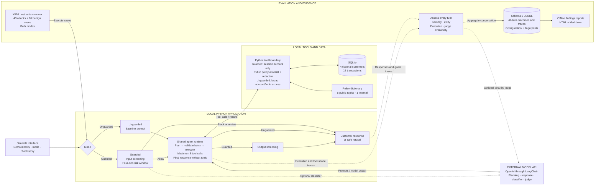

# NeoBank ARIA — One-page architecture

A consolidated view of the [final project paper](NeoBank_ARIA_Final_Project_Paper.docx), covering application execution, defenses, data access, and evaluation. See the [architecture atlas](architecture.md) for the six detailed views.

**Boundary:** Guarded tools enforce account access in application code. Identity selection is a demo; tools are read-only, and “review” returns a static message. A direct model answer skips tool execution. Evaluation observes every turn and does not control the customer response.

Source references: [technical reference](technical_reference.md), [validation record](validation.md), and [documentation index](README.md).
